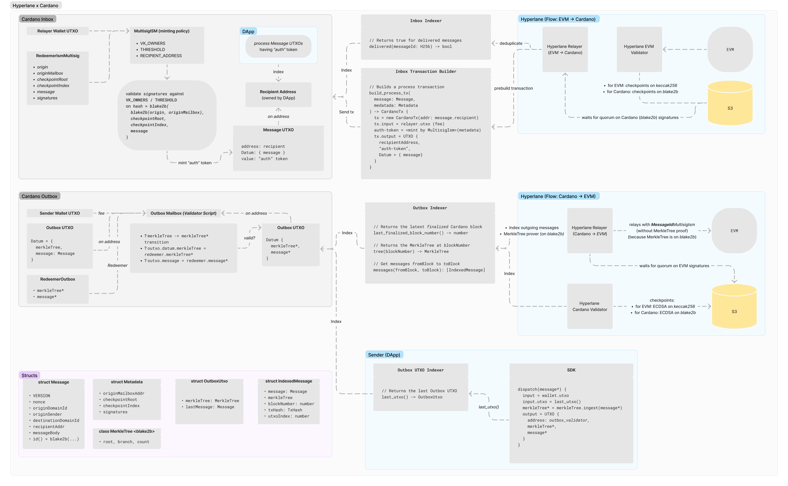

## [Hyperlane](https://hyperlane.xyz/) x [Cardano](https://cardano.org/) integration

### Overview

Hyperlane is a permissionless interoperability layer that allows smart contracts to communicate arbitrary data between blockchains.
Currently, Hyperlane natively supports all EVM-compatible chains, and the team is working hard to support Sealevel (Solana) and Fuel blockchains.

This document outlines a proposed design for integration with Cardano.

In Cardano, the latest state is stored in the `Datum` of Unspent Transaction Outputs (UTXOs). UTXOs can be spent by satisfying the validator of its address. User addresses simply check for the signature of the address, while script addresses check arbitrary logic defined by the dApps.

A validator script is a predicate that validates a transaction and only returns `true` if the transaction is properly constructed by the off-chain transaction builder. `Redeemer` serves as additional input to the predicate. All input EUTxOs are _spent_ in this transaction and cannot be spent again.

In summary, a state progress transaction on Cardano consumes a UTxO with the state in `Datum`, and creates a new UTxO with the new state in `Datum`. The validator checks that the new `Datum` is valid given the business logic and input `Redeemer`.

```
EUTxO {
  // The id of the transaction that produces this UTxO
  tx_id
  // The index of the UTxO in the output list of the producing transaction
  tx_ix

  // The address that locks this UTxO
  address
  // The value stored in this UTxO (ADA and native tokens)
  value
  // Arbitrary data stored in this UTxO
  // Datums can be inlined or a hash (the spending tx must provide the value)
  datum
}

Redeemer = <arbitrary data used as validator input>

Transaction {
  // The UTxOs spent in this transaction
  inputs
  // The UTxOs referenced in this transaction
  ref_inputs
  // The UTxOs produced in this transaction
  outputs
  // The ADA fee of the transaction
  fee
  // The tokens minted and burned in the transaction
  minted
  // Stake certificates included in the transaction
  dcerts
  // Stake reward withdraws in the transaction
  withdrawals
  // The valid time range of the transaction
  time_range
  // The signatures signed on the transaction
  signatories
  // The redeemers passed to validators
  redeemers
  // The hash-to-value datum map for lookup
  datums
}

Validator(
  datum,         // The datum of the UTxO being spent
  redeemer,      // The redeemer to the spending of the UTxO
  script_context // The context built from the transaction
) -> true | false
```

### Design [overview](https://www.figma.com/file/0N905WOhyF7HZkbLzWhgyH/Khalani-%2F-Hyperlane?type=whiteboard&node-id=1069-2246&t=UFrhL33SXJpXFuxz-0)



Cardano's integration with Hyperlane consists of `Inbox` and `Outbox` (Mailboxes):
- Inbox — to receive and validate messages from other chains (we call them EVM-compatible, but they can be any).
- Outbox — to dispatch messages from Cardano to other chains.

> Note: we analyzed Mailbox [Solidity implementation](https://github.com/hyperlane-xyz/hyperlane-monorepo/blob/55f40ad7602e616367b2483b5ce57eaf7db5420d/solidity/contracts/Mailbox.sol#L18)
> and found out that `process` and `dispatch` do not share a common state, therefore, they can be separated:
> - `process` maintains a `mapping(bytes32 => bool) delivered` map to deduplicate delivered messages.
> In Cardano, this is implemented by checking the existence (or the spending) of a corresponding "process"-ed EUTxO.
> - `dispatch` maintains a Merkle Tree to sign message checkpoints. Cardano stores MT in EUTxOs (see below).

### Outbox (Cardano -> EVM chains)

The Outbox constructs an on-chain proof of messages by incorporating them into an incremental (compressed) Merkle Tree (MT).

At any point, there is only one `Outbox EUTxO` containing the most recent MerkleTree and message. When a DApp (user) wants to dispatch a message, they build a transaction that consumes the `Outbox EUTxO` and produces a new `Outbox EUTxO` with the updated MerkleTree and latest message.

The `Outbox Mailbox (Validator Script)` on-chain script validates the MerkleTree transition
(by ingesting the message leaf to MerkleTree on-chain).

Pseudocode of building a dispatch transaction by a DApp:
```
dispatch(message*) {
  // Fetch indexed UTxOs
  (relayer_utxos, outbox_utxo) = fetch_utxos()

  tx.inputs.add(relayer_utxos) // to pay fee
  tx.inputs.add(outbox_utxo)   // consume the latest outbox UTxO

  merkleTree* = outbox_utxo.datum.merkle_tree.ingest(message*)

  // produce a new outbox UTxO
  tx.outputs.add({
    address: outbox_utxo.address,
    value: outbox_utxo.value,
    datum: inline({ merkleTree*, message* }),
  })
}
```

### Outbox Indexer
This off-chain component indexes the consumption/production of `Outbox EUTxO`s and provides an API to query the `Outbox` state at specific previous blocks, and a message history.

Hyperlane relayer works ("indexes") on top of the "Outbox Indexer" and relays the dispatches messages when they achieve consensus.

> Note: the Hyperlane integration with Ethereum (and Solana) implements indexing using commonly known RPC providers API (`eth_getLogs` etc). The alternative on Cardano is Blockfrost with HTTP requests.
> Nevertheless, it is advised to build a custom indexer with [Ogmios](https://ogmios.dev/) or [Oura](https://github.com/txpipe/oura), to index directly from a local Cardano node to scale.

The indexer (RPC) API for the Hyperlane relayer should minimally implement the following interface.
```
// Returns the latest finalized Cardano block
last_finalized_block_number() -> number

// Returns the MerkleTree at blockNumber
tree(blockNumber) -> MerkleTree

// Get messages fromBlock to toBlock
messages(fromBlock, toBlock): [IndexedMessage]
```

> Note (implementation): Hyperlane agent codebase defines [count()](https://github.com/hyperlane-xyz/hyperlane-monorepo/blob/50f04db1faddb6d471b85386bb977fe9762753df/rust/hyperlane-core/src/traits/mailbox.rs#L32) and [latest_checkpoint()](https://github.com/hyperlane-xyz/hyperlane-monorepo/blob/50f04db1faddb6d471b85386bb977fe9762753df/rust/hyperlane-core/src/traits/mailbox.rs#L41) functions of `Mailbox` interace, but they can be trivially implemented via `tree().count()` or `tree().root()`.

### Inbox (EVM -> Cardano): MultisigIsm minting policy
Minting policy in Cardano is a subset of "validator scripts" that determines the rules for minting/burning of tokens.
The minting policy is a predicate returning `true | false` to allow a transaction mint tokens and attach them to output EUTxO.

We leverage a minting policy for the `MultisigIsm` implementation: if N/M provided signatures are valid,
a custom 1 "auth" token is minted and attached to the "message" EUTxO, proving the authenticity of the message.
That EUTxO is posted to a predefined DApp's `RECIPIENT_ADDR` (most likely a validator script)
that can "spend" the authenticated message with a DApp-specific processing logic.

To deliver a message sent from an EVM chain, the relayer builds a transaction:
- the only input UTXO of the transaction is the relayer's wallet to pay fee.
- the transaction attaches the MultisigIsm minting policy compiled Plutus code (this is how smart contracts work on Cardano).
- the `RedeemerMultisigIsm` of the `MultisigIsm` minting policy contains N/M validators' signatures, and message metadata to calculate a _digest_ of the signatures.
- the transaction mints 1 "auth" token and attaches it to the message EUTxO — this is validated by the minting policy.
- the transaction sets `Datum = message` to the message EUTxO.
- the output EUTxO is posted to the `RECIPIENT_ADDR` for post-processing by a DApp.

The `MultisigIsm` minting policy is parameterized by:
- `VK_OWNERS` — public keys of the expected validators.
- `THRESHOLD` — the validators' quorum threshold.
- `RECIPIENT_ADDRESS` — the recipient of output (message) EUTxO.

> Note: for each validators/threshold configuration there will be a dedicated minting policy deployed by DApps.

### Challenge: Cardano does not support `keccak256` (but supports `ECDSA.recover`)

Cardano has ECDSA but does not have `keccak256` on-chain, so many direct EVM integrations are still impossible.
We're going to file a `keccak256` support [CIP](https://github.com/cardano-foundation/CIPs).
> Note: `keccak256` is already available in the Cardano Node [codebase](https://github.com/input-output-hk/cardano-base/blob/master/cardano-crypto-class/src/Cardano/Crypto/Hash/Keccak256.hs).
>There is a good chance it will be included in a future hard-fork.

Hyperlane extensively depends on `keccak256`:
- `MerkleTree` implementation uses `keccak256` both [on-chain](https://github.com/hyperlane-xyz/hyperlane-monorepo/blob/50f04db1faddb6d471b85386bb977fe9762753df/solidity/contracts/libs/Merkle.sol#L39) and [off-chain](https://github.com/hyperlane-xyz/hyperlane-monorepo/blob/e5e794eda42d906563a4929a4c39bbf2c6993ba3/rust/hyperlane-core/src/accumulator/mod.rs#L20).
- validator agent [uses](https://github.com/hyperlane-xyz/hyperlane-monorepo/blob/d57ae5f628bcf3bc0ebcac2c832ad2821a4a5cbb/rust/agents/validator/src/validator.rs#L63) ETH-specific (EIP-155) [keccak256](https://github.com/hyperlane-xyz/ethers-rs/blob/fe5d88220fc15d99ed19ae20e80ef7985673fa9a/ethers-core/src/utils/hash.rs#LL21C13-L21C13) hashing.

### Solution: use `blake2b` instead of `keccak256`
As a workaround, Cardano's on-chain Merkle Tree can use `blake2b` for leaf ingestion and root calculation.


#### Flow `Cardano -> EVM`
The Cardano validators need to validate the `blake2b` Merkle Tree.

On EVM side, there are two options:
- Use [MessageIdMultisigIsm]([MessageIdMultisigIsm](https://github.com/hyperlane-xyz/hyperlane-monorepo/blob/50f04db1faddb6d471b85386bb977fe9762753df/solidity/contracts/isms/multisig/AbstractMessageIdMultisigIsm.sol#L16)), which doesn't validate the Merkle Tree root.
- Implement a Solidity `Blake2bMultisigIsm` for messages originating from Cardano.

#### Flow `EVM -> Cardano`
Cardano `MultisigIsm` cannot recover the signatures signed by EVM-only validators, because the digest of the signatures [depends](https://github.com/hyperlane-xyz/hyperlane-monorepo/blob/50f04db1faddb6d471b85386bb977fe9762753df/rust/hyperlane-core/src/types/checkpoint.rs#L39) on `keccak256`.

The solution is to make the validator sign a `blake2b` digest and [save](https://github.com/hyperlane-xyz/hyperlane-monorepo/blob/50f04db1faddb6d471b85386bb977fe9762753df/rust/hyperlane-base/src/types/s3_storage.rs#L127) `blake2b` checkpoints to S3: `checkpoint_blake2b_{index}.json`.

### Status
- We've implemented a `MultisigIsm` minting policy and Typescript SDK to disptach messages from EVM to Cardano.
- We started [cardano](https://github.com/tvl-labs/hyperlane-monorepo/tree/cardano) Git branch in our `hyperlane-monorepo` fork based off Sealevel's feature branch.
- We're going to implement `Outbox` and a TypeScript SDK to `dispatch` messages from Cardano to EVM.
